# jdk7
## 1、将本项目下载下来直接导入idea中；
## 2、配置以下设置：
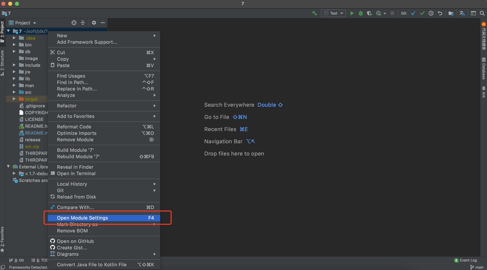
### 1）配置sdk:
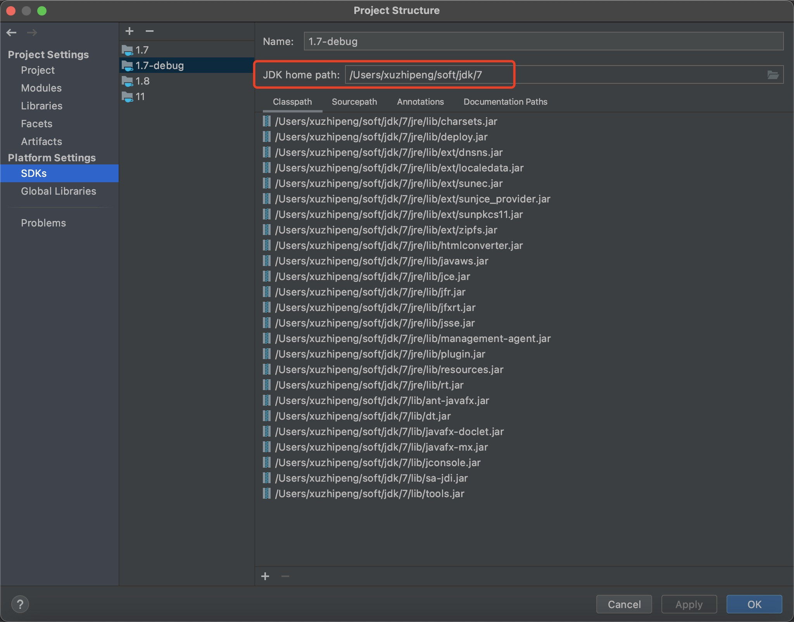
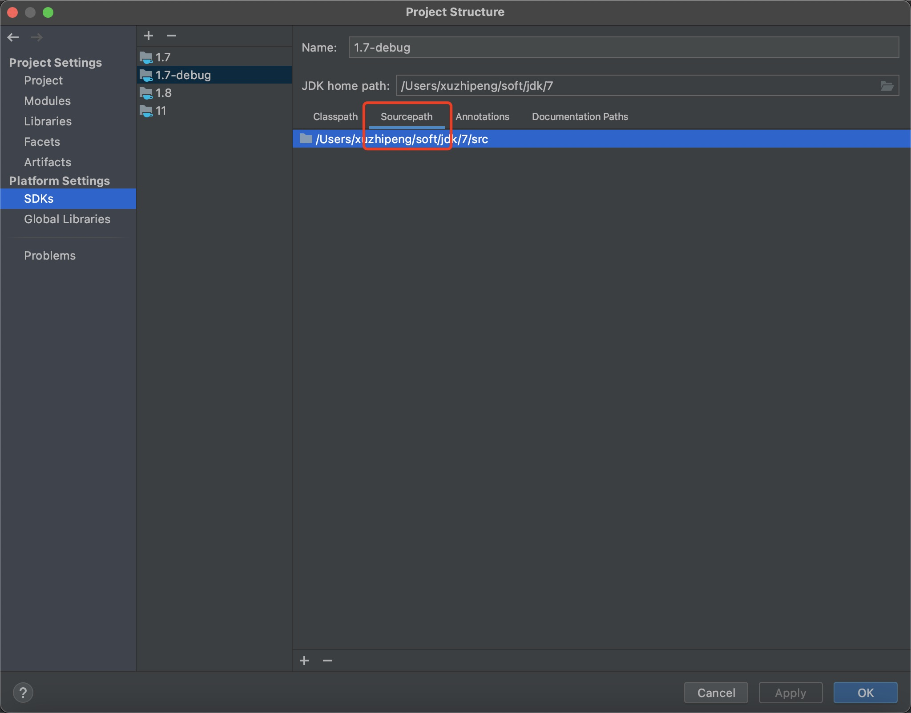
### 2）配置项目：
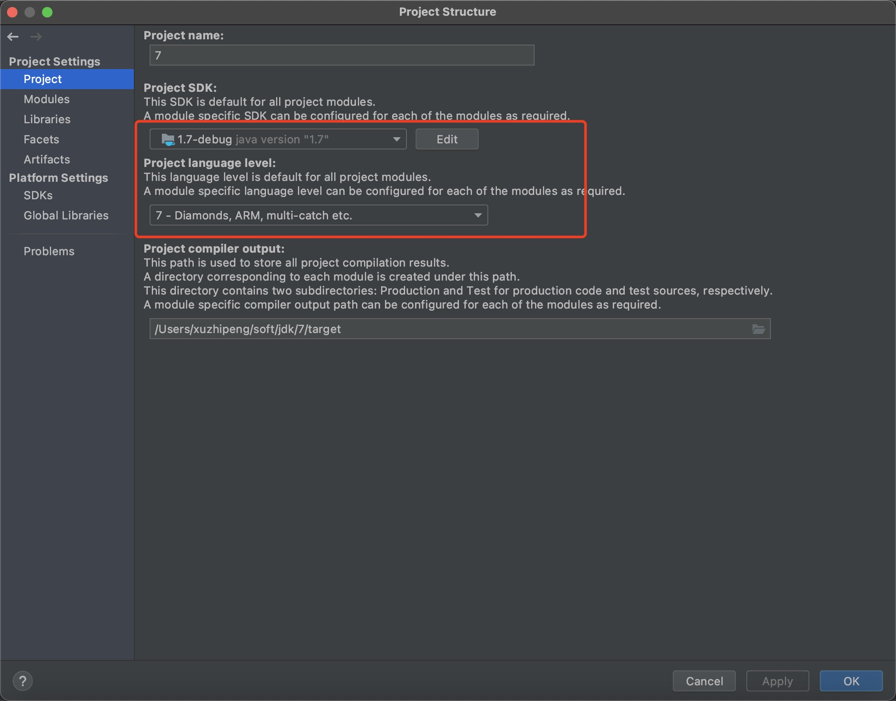
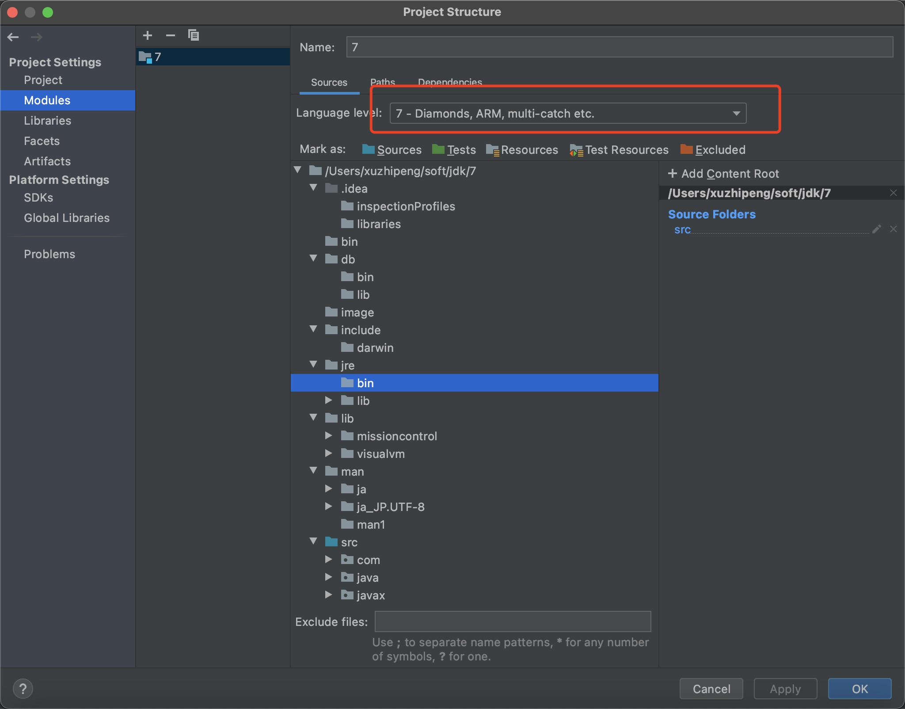
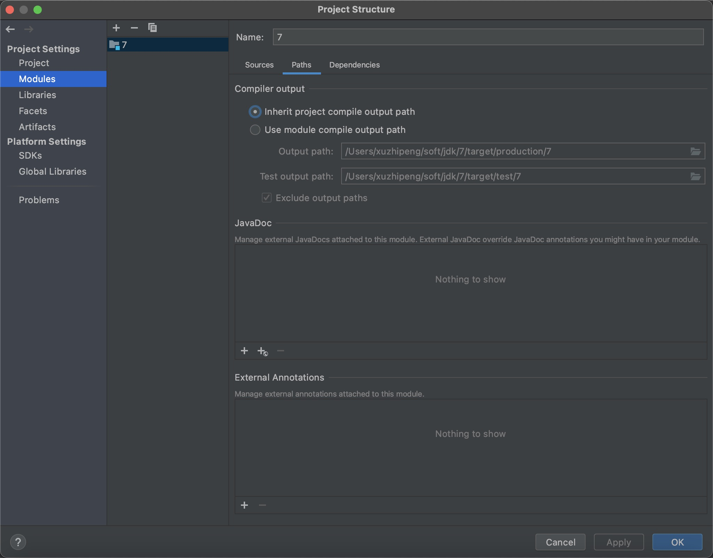
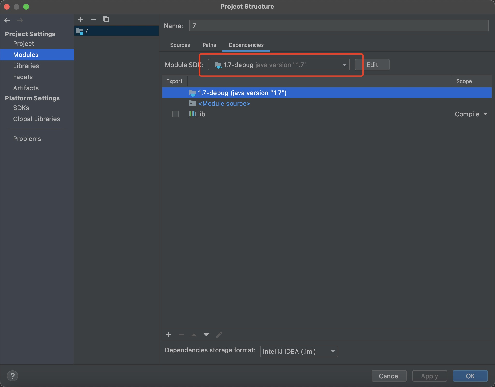
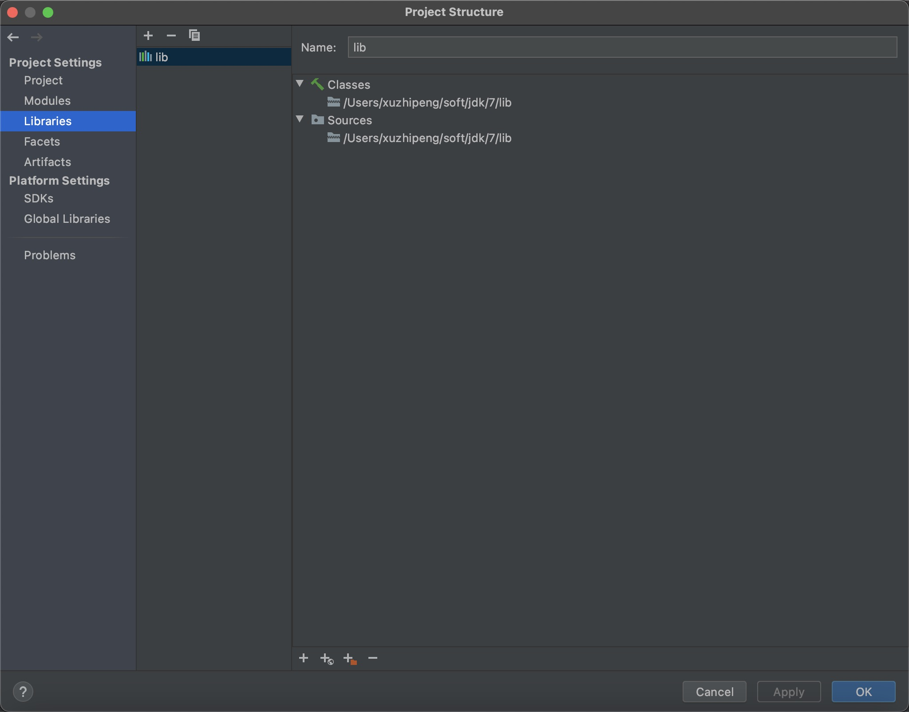
## 3、设置VM参数（让我们编译的代码要跑在jre/lib/rt.jar前面）
-Xbootclasspath/p:/Users/xuzhipeng/soft/jdk/7/target/production/7
/Users/xuzhipeng/soft/jdk/7/target/production/7是本项目class文件的路径
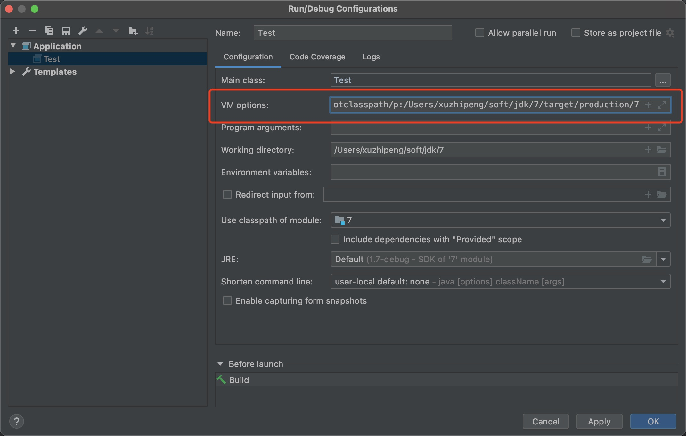
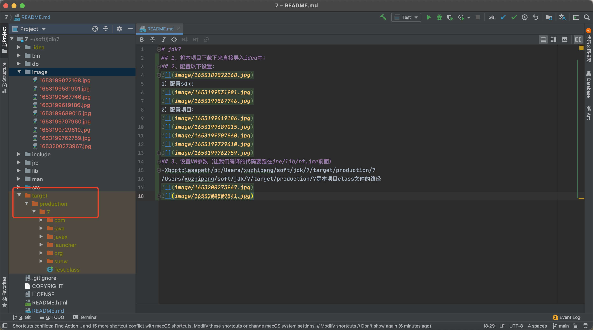
## 4、设置debug的时候可以跳进jdk源码，将java.*和javax.*前面的对钩去掉
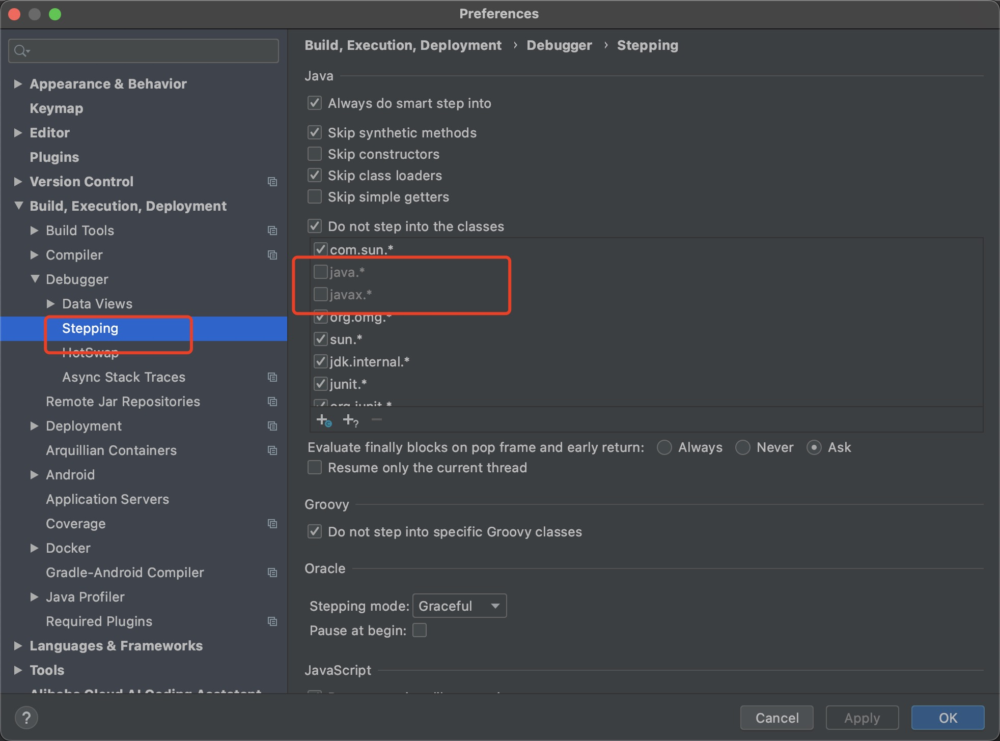
## 5、增大编译时的内存
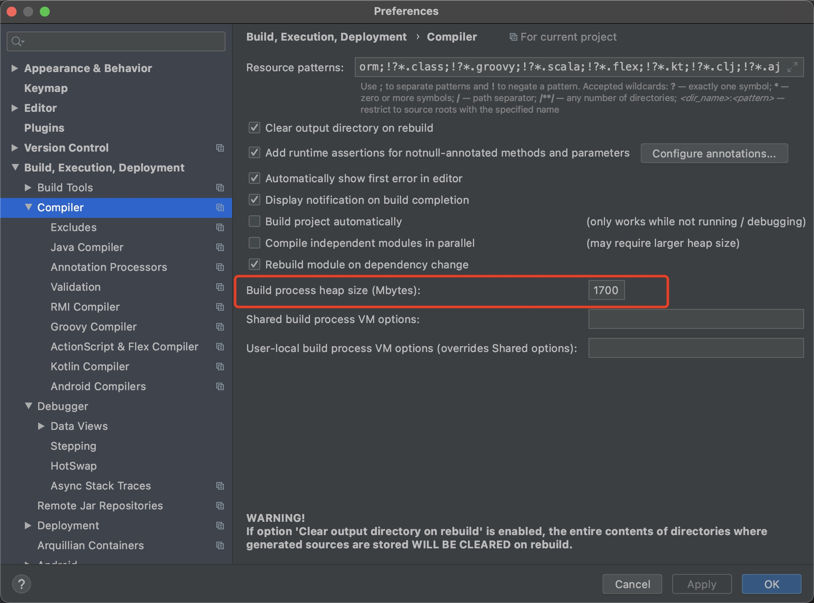